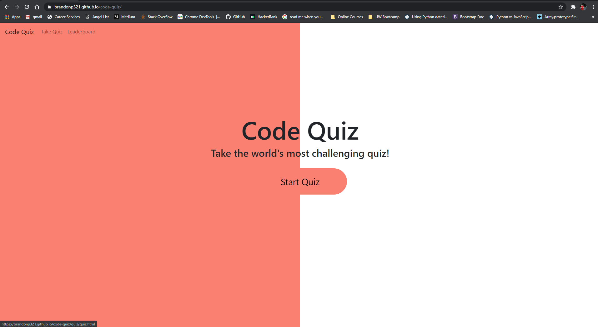
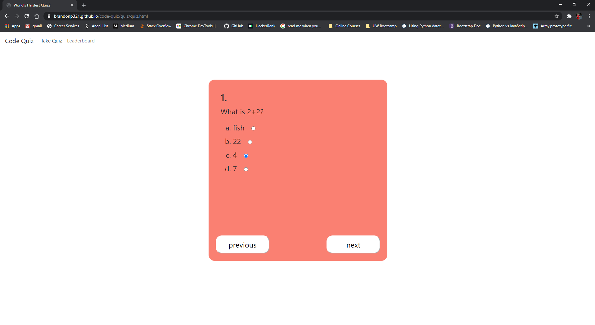

# Code Quiz
This is a rather simple site that allows the user to take a 5 question quiz, get their score, and then decide whether they want to store their score in local storage.  The user can also choose to visit the leaderboard page to see all of their past scores saved under different usernames.  The leaderboard has been populated with 3 other scores to add some material to the page rather than just having a blank page.  The page is set up to only save the user's score right after they take the quiz.  If they leave the page or even just refresh the page the user's score is reset so as not to cause errors if the user finishes the quiz but never adds their score to the leaderboard.

## Screenshots

## Website
website URL:    https://brandonp321.github.io/code-quiz/